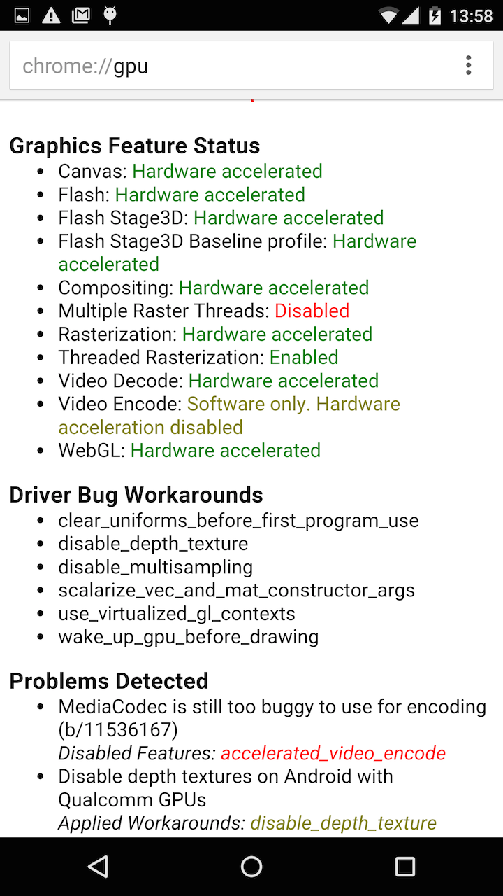
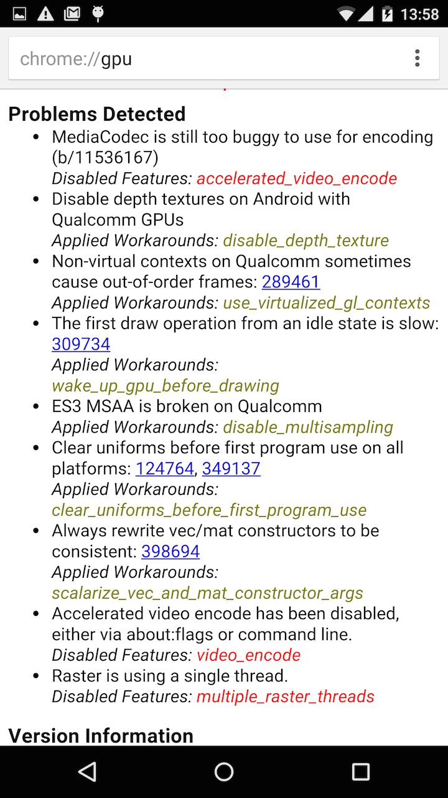
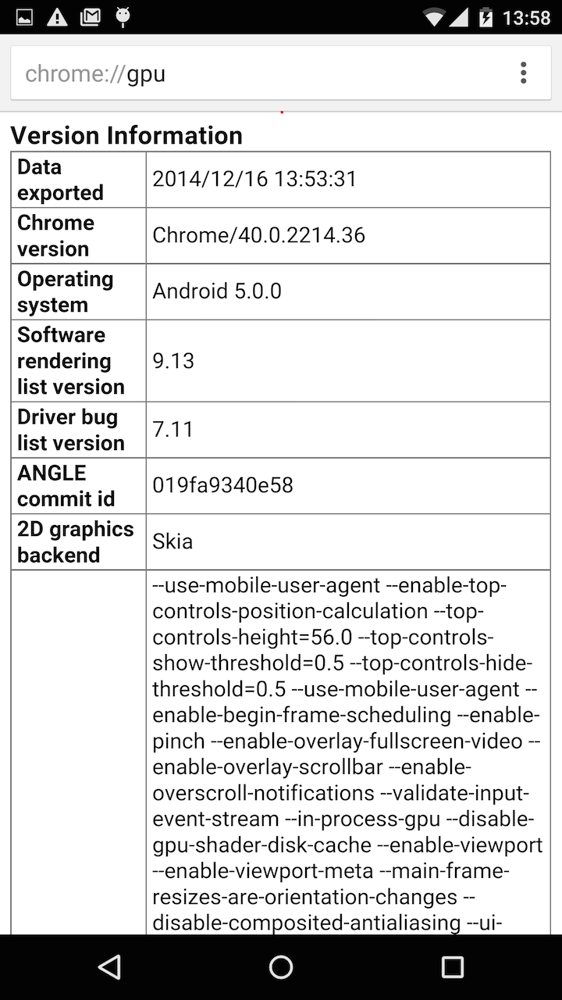
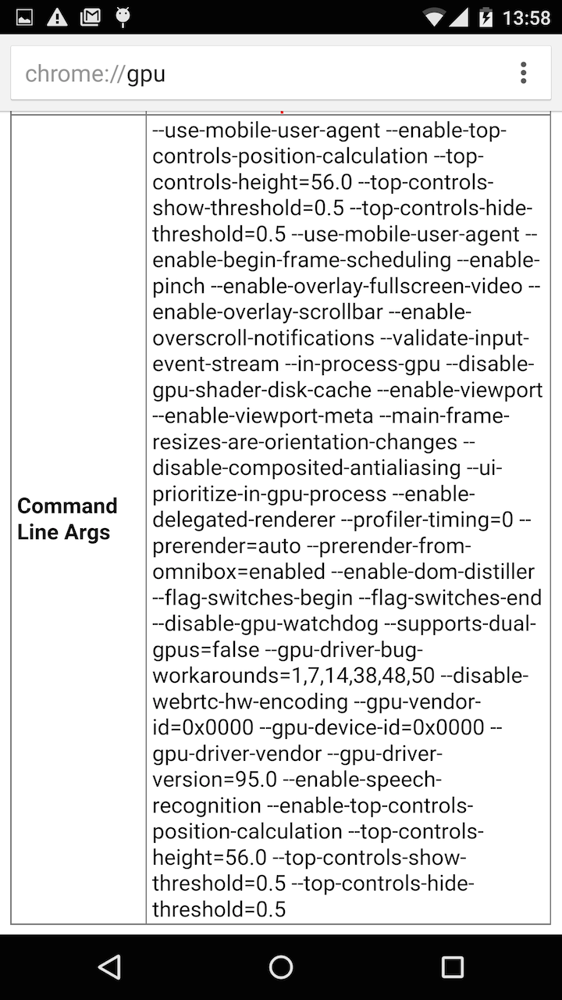
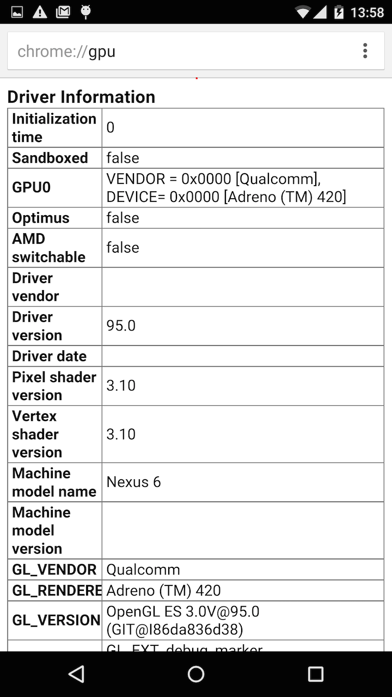
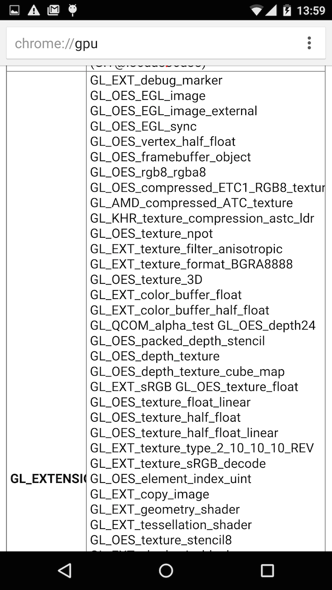
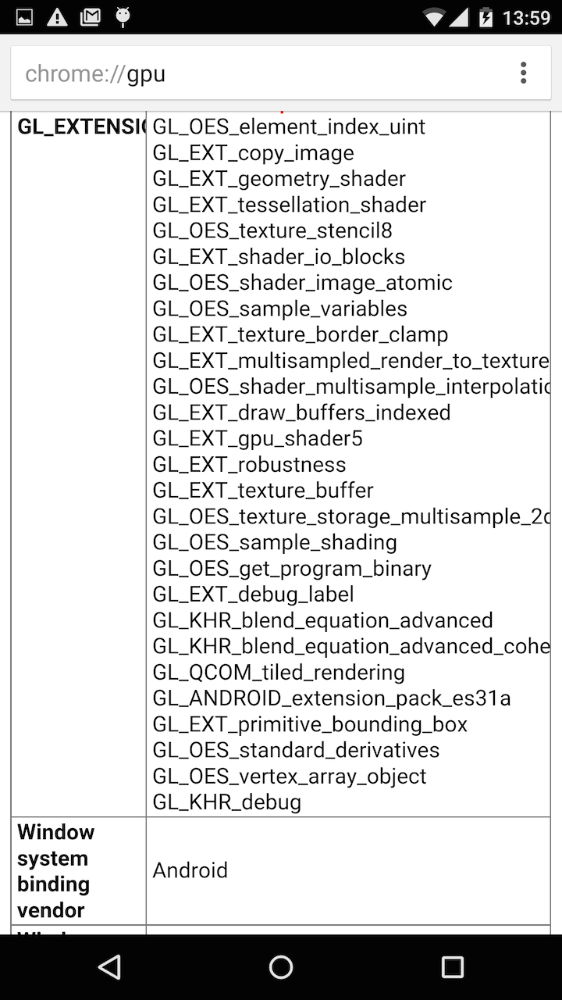
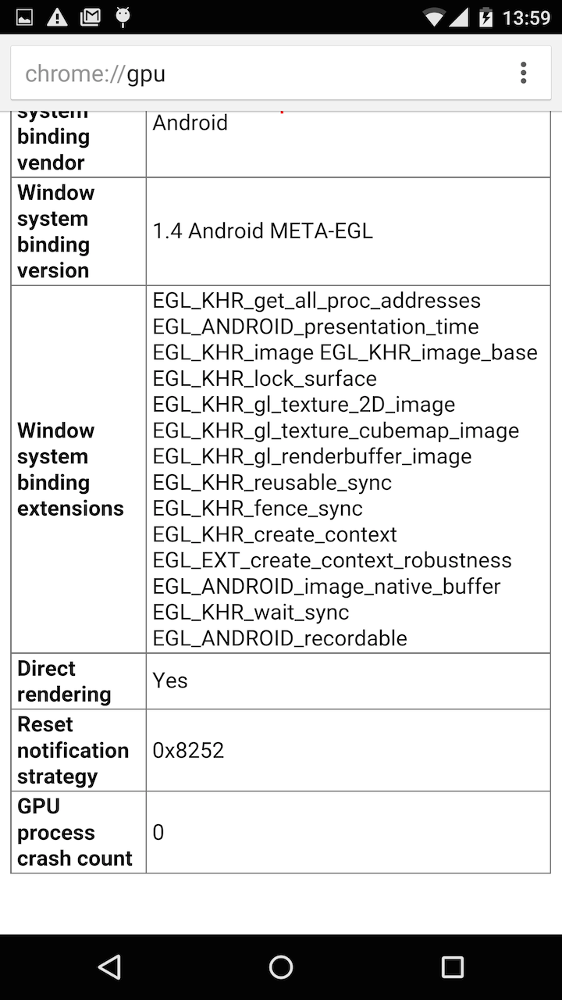

## Summary

GPU Accelerated Canvas is cleared after setTimeout.

### Version

Chrome Beta 40.0.2214.36

### OS
Android 5.0.0; Nexus 6 Build/LRX210

### What steps will reproduce the problem?

1. Chrome stable or Chrome beta run on Androidd 5.0.0 Nexus 6.
2. open example [fail.html](./fail.html), a pacman is moved to the right.

### What is the expected behavior?

[good.html](./good.html), display the three pacmans.

### What went wrong?

1. setTimeout call.
2. exec some canvas path API.
3. clear all pixels (The expected behavior is that still have the previous drawing).

This problem has occurred only in Nexus 6.

- see [Nexus6 Canvas render failure movie](https://www.youtube.com/watch?v=pAMTDuwOuP0)
    - 1st page is [good.html](./good.html).
    - 2nd page is [fail.html](./fail.html).

### Additional tests.

1. use requestAnimationFrame. [test page](./fail.raf.html) [movie](http://youtu.be/Yhbw8J31wyg)
2. use requestAnimationFrame + drawImage. [test page](fail.raf.image.html) [movie](http://youtu.be/d162FZfETR4)

### Additional tests (2015-02-23)

I tried Chrome 41.0.2272.63. [movie](http://youtu.be/Pb2R8Zokp2U)

Unfortunately, I looks like the situation is getting worse.

The head of packman may disappear.

### More Informations

- [good/fail demo page source code](https://gist.github.com/uupaa/bfd9b3d64e9719e7a9dc)
- [Nexus6 Canvas render failure with Nexus7](http://youtu.be/eVK5WUI8Gnk)
- 
- 
- 
- 
- 
- 
- 
- 

